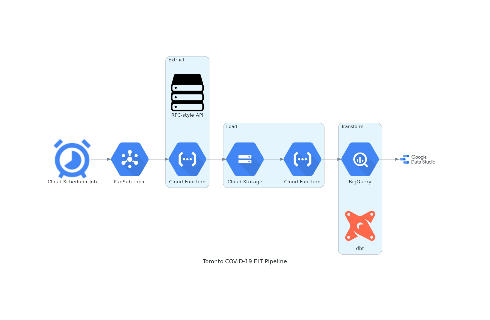

# toronto-covid-cases

Data retrieved from: https://open.toronto.ca/dataset/covid-19-cases-in-toronto/

## Visualization

https://datastudio.google.com/reporting/7780fef9-2ebc-41fb-a31b-1568fa4392a3

### Architecture

1. Create a Cloud Function which calls the Toronto API and uploads the data to Google Cloud Storage. The function should be subscribed to a specific Pub/Sub topic.
2. Create a Cloud Scheduler job which invokes a Pub/Sub trigger to send a message to the Pub/Sub topic that the aforementioned function is subscribed to.
    - job runs on the 1st of each month
3. Upon upload to Cloud Storage, another Cloud Function is triggered to move the file to BigQuery.
    - the data overwrites existing data in the staging table 
    - the data stays denormalized as a flat table
4. dbt makes simple transformations to create two models in BigQuery for use in Data Studio

### Improvements
- this probably could've been down without using Cloud Storage at all and just directly inserted into BigQuery
- the Cloud Function to upload to Cloud Storage uploads the results from the API to `/tmp/`. Some potential ideas for a more scalable solution:
    - chunk the results into smaller files
    - creating a read stream, passing it through a stream-based process, and writing the output stream directly to Cloud Storage
- currently, duplicate data can theoretically be inserted into the staging table in BQ. dbt deduplicates the data when creating the models but the staging table has to be manually cleaned. Can schedule the deduplication query or add it to the event trigger function
- dbt has to be run manually to refresh models; can also automate with cron, Airflow, Cloud Scheduler, etc.,
- add a few simple tests in dbt